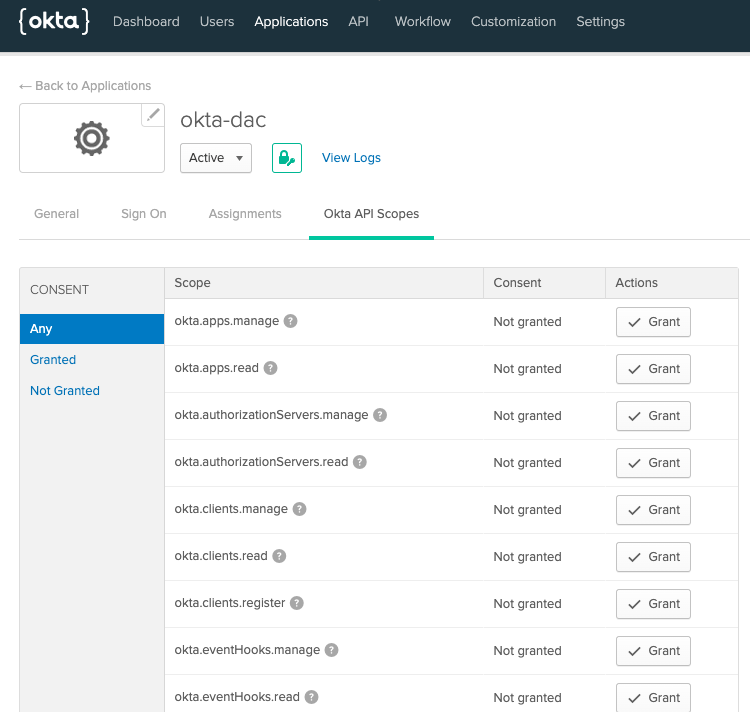

ℹ️ Disclaimer: This project serves as a Sample Application, that you can tweak or completely repurpose. It is community-supported and is maintained by members of the Okta team for developers and other IT professionals. DAC is not an official Okta product and does not qualify for any Okta support. Okta makes no warranties regarding this project. Anyone who chooses to use this project must ensure that their implementation meets any applicable legal obligations including any Okta terms and conditions.

ℹ️ It is recommended that you collaborate with your preferred Okta Solution Provider [(link)](https://www.okta.com/partners/meet-our-partners/?field_partner_type_tid=8101&field_solutions_target_id=6061) to implement and adapt this app code sample within your existing portal. This app features frontend and backend components and like any web app hosted and running on your side, you should perform a code review, as well as security and scalability tests.

# DAC 
__Delegated Admin Console__


This project is built in Vue.js and uses

- [Vuetify 2.x](https://vuetifyjs.com/en/) Material Design Component Framework
- [Okta Vue.js SDK](https://github.com/okta/okta-oidc-js/tree/master/packages/okta-vue)
- [Okta Sign-in Widget](https://github.com/okta/okta-signin-widget)

## Setup

Setting up the required configurations in Okta; the API Gateway and lambda functions (in AWS, for the [REST APIs](/dac-api)) are quite involved. So we've leveraged [Terraform](https://www.terraform.io/) and [Serverless](https://www.serverless.com), and provided a Makefile:

### Prerequisites

1. **macOS Catalina issues:** You must be able to run `npm install`. 
    * The Makefiles runs `npm install` commands. You should make sure that your machine is able to run this command without any issues.
    * If you are getting the error *"gyp: No Xcode or CLT version detected!"* on macOS Catalina, [follow these steps](https://medium.com/flawless-app-stories/gyp-no-xcode-or-clt-version-detected-macos-catalina-anansewaa-38b536389e8d)

2. Install [terraform](https://learn.hashicorp.com/terraform/getting-started/install)
3. Install [Serverless](https://www.serverless.com/framework/docs/getting-started/)

   e.g. via npm:
   
   cd to the /byob-dashboard folder and run:

   ```
   npm install -g serverless
   ```

   Note: if you get WARN/ERR on MacOS, run:

   ```
   sudo npm install -g serverless
   ```

4. Install [vuecli](https://cli.vuejs.org/#getting-started)

   e.g. via npm:

   ```
   npm install @vue/cli -g
   ```

   Note: if you get WARN/ERR on MacOS, run:

   ```
   sudo npm install -g @vue/cli --unsafe-perm
   ```
5. Create a Named Profile in AWS. [Steps](https://docs.idp.rocks/setup/#create-named-profile-in-aws-cli)
6. Enable Programmatic Access for Okta. [Steps](https://docs.idp.rocks/setup/#enable-programmatic-access-to-okta)

### Environment Variables

* Copy the file `/terraform/terraform.tfvars.template` into `/terraform/terraform.tfvars` and edit it with your Org variables:

    ```
    org_name          = "<org subdomain>"
    base_url          = "<oktapreview.com || okta.com>"
    api_token         = "<OKTA_API_TOKEN>"
    app_url           = "http://localhost:8080"
    superuser_email   = ""
    environment       = "dev"
    aws_region        = "us-east-1"
    aws_profile       = "(see Prerequisites Step 5.)"
    aws_ssm_prefix    = "dac"
    ```

    Where the above variables are: <a name="variable-names"></a>

    | Variable              | Description                                                                | Default Value           |
    | --------------------- | :------------------------------------------------------------------------- | ----------------------- |
    | org_name              | Okta Org subdomain name (e.g. "atko")                                      |                         |
    | base_url              | Base URL for the Okta org (okta.com or oktapreview.com)                    | "okta.com"              |
    | api_token             | OKTA_API_TOKEN, per [Prerequisites Step 6.](#prerequisites)                |                         |
    | app_url               | Base URL for the SPA.                                                      | "http://localhost:8080" |
    | superuser_email       | Enter the Super Admin email/username you use to login to your Org          |                         |
    | environment           | Stage configured in API Gateway (dev, prod, ...)                           | "dev"                   |
    | aws_region            | Region to deploy AWS components.                                           | "us-east-1"             |
    | aws_profile           | Profile configured in AWS CLI. per [Prerequisites Step 5.](#prerequisites) |                         |
    | aws_ssm_prefix        | Prefix for parameters created in AWS Parameter Store.                      | "dac"                   |

---

## Make
Once `/terraform/terraform.tfvars` is populated correctly, run Make:
```
make all
```
The above will:
1. Run the provided Terraform scripts to configure your Okta Org
2. Deploy the API using Serverless
3. Create the local env file (`.env.development.local`) for the SPA

If you didn't see any errors during `make`, you're *almost* ready to go. But there is one manual step to complete:

## (Required) Manual Step
Terraform currently does not support granting Okta API Scopes. These are required for okta-dac to properly function.


1. Login to your Org's Admin Console. Search for the `okta-dac` app
2. Navigate to the **Okta API Scopes** tab and Grant the following scopes:
    * `okta.groups.manage`
    * `okta.users.manage`

## Run
`cd` into the `dac-spa` folder and run
```
npm run serve
```
Then, open your browser to `http://localhost:8080` and login

---

## Step-by-step Options
If you would rather do things step by step, do not run `make all`. Deploying this project has 3 parts:
1. Run the provided Terraform scripts. Click [here](terraform#okta-setup) for next steps.
2. Deploy the API. Click [here](dac-api#serverless) for next steps.
3. Bring up the spa on localhost. Click [here](dac-spa#make) for next steps.

