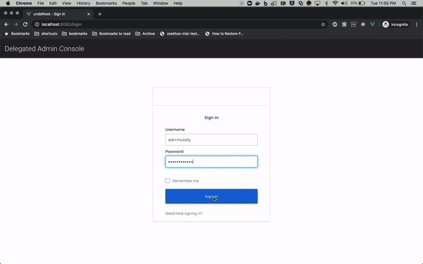

# Delegated Admin Console (DAC)

ℹ️ Disclaimer: This project is community-supported and is maintained by members of the Okta team for developers and other IT professionals. DAC is not an official Okta product and does not qualify for any Okta support. Okta makes no warranties regarding this project. Anyone who chooses to use this project must ensure that their implementation meets any applicable legal obligations including any Okta terms and conditions.

ℹ️ It is recommended that you collaborate with your preferred [Okta Solution Provider](https://www.okta.com/partners/meet-our-partners/?field_partner_type_tid=8101&field_solutions_target_id=6061) to implement and adapt this app code sample within your existing portal. This app features frontend and backend components and like any web app hosted and running on your side, you should perform a code review, as well as security and scalability tests. 



## Project setup

```sh
npm install
```

### Config File

Add a file `.env.development.local` (in the root directory) with these contents:

```sh
VUE_APP_CLIENT_ID=<<client id here>>
VUE_APP_ISSUER=<<issuer uri here>>
VUE_APP_API=<<rest api endpoint>
VUE_APP_ENFORCE_DOMAIN_CHECK=true
```

* `VUE_APP_API` refers to the REST endpoint of the deployed [okta-dac-api](https://github.com/udplabs/okta-dac-api) project, which is separate to this project.

* DAC enforces that Tenant Admins add users with emails that match only verified domains. However, this may be difficult if you want to test with usernames having `@mailinator.com` (for example). Simply set `VUE_APP_ENFORCE_DOMAIN_CHECK=false` and DAC will stop validating domains.

#### Webfinger and Domain Verification Plugin

This project uses Okta routing rules (idp discovery) by default. Due to known scaling limitations, it is advisable to not use the okta idp discovery functionality for anything above 200 inbound IdPs. If you anticipate a large number of inbound federation with idp-discovery, then:

* Deploy the [okta-dac-domains-serverless](https://github.com/udplabs/okta-dac-domains-serverless) microservice instead.
* Add the following setting in the `.env` file:

```sh
VUE_APP_USE_WEBFINGER_PLUGIN=true
VUE_APP_WEBFINGER_PLUGIN=<<url of the microservice>>
```

This setting will use the microservice for storing domains, unverified domains (for domain verification) and idp-discovery functionality.

#### Stylesheet options

Add a file `.env.local` (in the root directory) with these contents:

**Values below are for example purposes**

```sh
# Styling Information
VUE_APP_LOGO=https://cdn.freelogovectors.net/wp-content/uploads/2018/05/workday-logo-icon.png
VUE_APP_MAINCOLOR=#ffa126
VUE_APP_COMPANY_NAME=Workday
```

### Compiles and hot-reloads for development

```sh
npm run serve
```

### Compiles and minifies for production

```sh
npm run build
```
